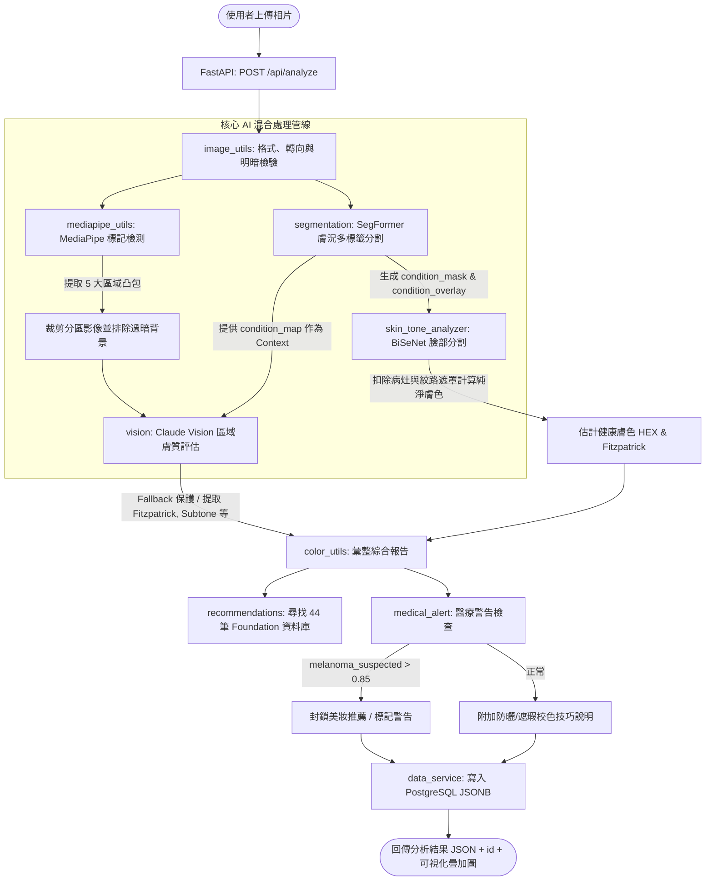

# Lumière 系統分析管線與模型盤點報告

本報告針對 Lumière 後端系統的影像分析管線（Pipeline）與模型清單進行全面盤點，詳述其順序、功能、使用模型、每一步驟的輸入輸出，以及目前系統內所有模型（使用中、未使用、測試中）的名稱、位置與功能說明。

---

## 1. 系統分析管線 (Analysis Pipeline)

Lumière 後端採用 FastAPI，建構了一套混合式的 AI 分析管線。該管線結合了本機深度學習模型（SegFormer、BiSeNet）、本機人臉特徵定位模型（MediaPipe Face Landmarker）以及雲端多模態大模型（Claude Vision VLM）。

### 核心分析管線流程圖 (Pipeline Logic Flow)



### 管線步驟詳解 (Detailed Pipeline Steps)

#### 步驟一：影像讀取與檢驗 (Image Validation & Preprocessing)
* **主要模組**：[image_utils.py](file:///l:/Lumiere/Back_Lumiere/dev/app/image_utils.py) (`load_and_validate` 與 `preprocess`)
* **主要功能**：
  1. 對上傳的圖片進行二進位圖檔驗證與 BGR 轉 RGB。
  2. 自動偵測與校正手機拍攝時產生的 EXIF 旋轉方向。
  3. 檢驗相片品質：過濾尺寸過小（單邊 < 300px）、亮度過暗（平均亮度 < 20）或亮度過亮/過曝（平均亮度 > 235）的相片。
  4. 將影像等比例縮放至設定的最大邊長（預設為 1024px），並轉換為 Base64 字串以供後續大模型調用。
* **使用模型**：無（純影像運算與幾何處理）。
* **輸入**：原始圖片二進位內容 (`contents: bytes`)。
* **輸出**：預處理後的影像字典，包含：
  * `"array"`: 調整大小後的 RGB 影像矩陣 (`np.ndarray`，型態 `uint8`)。
  * `"base64"`: JPEG 格式的 Base64 編碼字串 (`str`)。
  * `"shape"`: 調整大小後的影像維度 (`tuple` [height, width])。

#### 步驟二：膚況與病灶分割 (Skin Condition & Wrinkle Segmentation)
* **主要模組**：[segmentation.py](file:///l:/Lumiere/Back_Lumiere/dev/app/segmentation.py) (`get_condition_outputs`)
* **主要功能**：
  1. 對預處理後的面部影像進行語意分割推論。
  2. 使用連通域算法（`_clean_binary_mask`）去除極小面積的雜訊預測（小於影像總面積 0.02% 的斑塊會被忽略）。
  3. 評估各病灶在面部所在的特徵區域（如額頭、臉頰、下巴、面部中央等，透過 `_estimate_zones` 估算）。
  4. 生成包含渲染色彩斑塊與白色細邊框的面部病灶疊加可視化圖 `condition_overlay`。
* **使用模型**：**SegFormer**（語意分割模型，詳見下文模型盤點）。
* **輸入**：步驟一輸出的 `img_array` (np.ndarray)。
* **輸出**：結構化分割結果字典，包含：
  * `condition_mask`: 二維分類遮罩 (`np.ndarray`，大小同輸入影像，像素值對應標籤：0=正常, 1=白斑, 2=黃褐斑/黑斑, 3=鮮紅斑痣, 4=額頭皺紋, 5=魚尾紋, 6=法令紋)。
  * `condition_map`: 病灶結構化字典，詳細紀錄各類膚況的檢測結果。
    ```json
    {
      "vitiligo": { "detected": false, "area_percent": 0.0, "zones": [] },
      "melasma": { "detected": true, "area_percent": 4.12, "zones": ["left_cheek"] },
      ...
    }
    ```

#### 步驟三：臉部特徵點與分區裁剪 (Face Landmark Detection & Region Cropping)
* **主要模組**：[mediapipe_utils.py](file:///l:/Lumiere/Back_Lumiere/dev/app/mediapipe_utils.py) (`get_landmarks` 與 `extract_region_crops`)
* **主要功能**：
  1. 使用 MediaPipe Face Landmarker 定位臉部的 478 個特徵點。
  2. 根據核心特徵點定義五大臉部區塊：額頭（`testa`）、左頰（`bochecha_e`）、右頰（`bochecha_d`）、鼻子（`nariz`）、下巴（`queixo`）。
  3. 分別計算這五個分區特徵點的凸包（Convex Hull），剪裁出包含 15px 邊緣填充的外接矩形影像。
  4. 在轉碼前過濾過暗像素（如頭髮、陰影、背景，即 RGB 亮度最大值 < 30 的像素會被設為純黑 `[0, 0, 0]`），以確保截取的影像聚焦於真實皮膚。
* **使用模型**：**MediaPipe Face Landmarker**（輕量級 TFLite 臉部網格定位）。
* **輸入**：步驟一輸出的 `img_array` (np.ndarray)。
* **輸出**：
  * `coords`: 五大面部區塊的特徵點座標字典。
  * `crops`: 五大分區的裁剪結果字典，包含分區的 RGB 影像 `array` 與 Base64 編碼 `base64`。

#### 步驟四：健康膚色估計與分區膚色分析 (Healthy Skin Tone Estimation)
* **主要模組**：[skin_tone_analyzer.py](file:///l:/Lumiere/Back_Lumiere/dev/app/skin_tone_analyzer.py) (`analyze_skin_tone`)
* **主要功能**：
  1. 呼叫 BiSeNet 模型進行臉部 14 分類 Parsing 分割，取得精確的皮膚區域（Skin Label = 1）。
  2. **重要演算法（健康皮膚遮罩提取）**：為了排除大面積病斑或皺紋色彩干擾，使用以下公式交叉遮罩：
     $$\text{Healthy Mask} = (\text{BiSeNet Map} == \text{Skin Label}) \land (\text{SegFormer Mask} == 0)$$
     僅計算「是皮膚且無 SegFormer 病灶遮罩」的區塊像素。
  3. 對健康皮膚像素計算 **Median (中位數) RGB**，藉此代表使用者的代表性膚色 HEX 值。
  4. 各自裁切並計算額頭、眼下、臉頰、嘴角周圍、下顎線等 5 個子分區的獨立 HEX 膚色值。
* **使用模型**：**BiSeNet**（臉部語意分割模型，搭載 ResNet-18 骨幹網絡）。
* **輸入**：步驟一輸出的 `img_array` (np.ndarray)、步驟二輸出的病灶遮罩 `condition_mask` (np.ndarray)。
* **輸出**：結構化膚色估算字典：
  * `"median_hex"`: 整體健康皮膚代表性的 HEX 色值。
  * `"median_rgb"`: 整體健康皮膚之中位數 RGB 數值。
  * `"num_skin_pixels"`: 判定為健康皮膚的總像素數。
  * `"zones"`: 包含 5 個子分區獨立膚色的字典（各含 `hex` 與 `rgb` 欄位）。

#### 步驟五：分區細緻膚質分析 (Fine-grained Regional Skin Analysis)
* **主要模組**：[vision.py](file:///l:/Lumiere/Back_Lumiere/dev/app/vision.py) (`analyze_region`)
* **主要功能**：
  1. 將步驟三裁剪出的五個分區影像 Base64，與步驟二獲得的 SegFormer 病灶字典 `condition_map` 作為上下文背景（Context），組裝成結構化系統 prompt。
  2. 將分區影像與 Prompt 傳送給 Claude Vision 模型進行分析。
  3. **模型對照與防盲從設計**：Claude 必須比對影像特徵與 SegFormer Context。若視覺特徵不支持 SegFormer 的預測，模型不得盲從。
  4. Claude 回傳該區域的 Fitzpatrick 膚色評級、副色調、油脂度、面部瑕疵（面皰、色素沉著、毛孔、紋路、紅斑等類型與嚴重度）、膚色均勻度以及疑似黑色素瘤（`melanoma_suspected`）信賴分數。
  5. **安全 Fallback 機制**：若呼叫 Anthropic 發生 API 錯誤或逾時，會自動捕捉例外並回傳預設正常健康結果，確保系統不崩潰。
* **使用模型**：**Claude Vision VLM** (`claude-opus-4-5`)。
* **輸入**：區域名稱 `region_name`、裁剪影像 `b64_crop`、SegFormer 病灶資訊 `condition_map`、語系參數 `lang`。
* **輸出**：大模型推論生成的結構化區域報告 JSON，如：
  ```json
  {
    "tom_hex": "#c68b6e",
    "tom_fitzpatrick": 3,
    "subtom": "neutro",
    "oleosidade": "normal",
    "imperfeicoes": [{"tipo": "mancha", "intensidade": "leve"}],
    "uniformidade": 8,
    "condition_map": {
      "melanoma_suspected": { "confidence": 0.1, "reason": "No suspicious lesions visible." }
    },
    "notas": "Pele com boa uniformidade e poucas imperfeições na testa."
  }
  ```

#### 步驟六：色差計算、美妝推薦與醫療警告檢查 (Shade Matchmaking & Medical Triage)
* **主要模組**：[color_utils.py](file:///l:/Lumiere/Back_Lumiere/dev/app/color_utils.py) (`build_final_report`)、[recommendations.py](file:///l:/Lumiere/Back_Lumiere/dev/app/recommendations.py)、[medical_alert.py](file:///l:/Lumiere/Back_Lumiere/dev/app/medical_alert.py)
* **主要功能**：
  1. 根據各區域的膚色計算 **Luma-Weighted Euclidean Distance** 色差 $\Delta E$：
     $$\Delta E = \sqrt{(0.299 \times \Delta R)^2 + (0.587 \times \Delta G)^2 + (0.114 \times \Delta B)^2}$$
     藉此評估臉部各分區間的色泽對比與均勻度級別。
  2. 使用 BiSeNet 估計的中位數膚色色值，過濾符合使用者副色調排序的粉底（暖調、中性、冷調），並在 44 筆粉底色號資料庫中依 $\Delta E$ 距離進行最佳匹配推薦（限制各品牌僅推薦 1 款）。
  3. **醫療警告攔截機制 (Medical Triage)**：
     檢查 Claude 回傳的潛在風險（如 `melanoma_suspected` 黑色素瘤、`suspicious_lesion` 可疑皮損、`urgent_skin_concern` 緊急皮膚狀況）。若其中之一的信賴分數 $\ge 0.85$，系統會**強制封鎖美妝推薦**（將推薦清單設為空），並生成紅色警示視窗，引導使用者先行尋求專業皮膚科醫生診治。
  4. 整合 SegFormer 渲染生成的 PNG 疊加圖 `condition_overlay`。
* **使用模型**：無（純演算法與規則庫）。
* **輸入**：步驟五的五區分析結果 `region_results`、步驟四的膚色估計 `skin_tone`。
* **輸出**：最終彙整的 JSON 診斷報告，包含整體 Fitzpatrick 級數、HEX 膚色、副色調、分區報告、色差比較、瑕疵清單、粉底液推薦、醫療警告 `medical_alert` 說明、是否被攔截標記 `recommendations_blocked`、以及病灶疊加可視化圖 `condition_overlay`。

---

## 2. 系統模型盤點表 (System Model Catalog)

Lumière 系統目錄與模型訓練結構中，包含的多個已部署、備用、測試中或已廢棄之模型檔案整理如下：

### (1) 執行期加載模型 (In-Use / Active)

| 模型名稱 | 模型類別/架構 | 位置 (Workspace 相對路徑/來源) | 運行狀態 | 職責與功能說明 |
| --- | --- | --- | --- | --- |
| **SegFormer 多標籤膚況模型** | `SegformerForSemanticSegmentation` | `training/checkpoints/SegFormer/segformer_melasma_model_2/best` (與 `last`) | **使用中** (當前生產第一優先) | 當前生產預設載入之多標籤分割模型。可用於偵測：黑斑/色素沉著 (`black_spot` 映射為 `melasma`，Test IoU=**0.7412**), 額頭皺紋 (`forehead_wrinkle`，IoU=0.4896), 魚尾紋 (`crow_s_feet`，IoU=0.3246) 及法令紋 (`nasolabial_fold`，IoU=0.3569)。此模型**不包含**白斑與鮮紅斑痣類別。 |
| **BiSeNet 臉部解析模型** | `BiSeNet` + `Resnet18` 骨幹 | `training/checkpoints/bisenet_best.pth` | **使用中** | 14 分類臉部語意分割模型。負責分割出面部的皮膚區域（Skin Label = 1）以及其他器官（如眼睛、嘴唇、眉毛），用以扣除 SegFormer 病灶，實現健康無瑕疵膚色的中位數精密計算。 |
| **MediaPipe Face Landmarker** | `FaceLandmarker` (TFLite) | 下載至本機：`~/face_landmarker.task` | **使用中** | 面部網格與特徵點定位模型（大小約 1MB）。定位臉部 478 個特徵點，提供座標做為五大臉部區域的外接矩形與 Convex Hull 裁剪計算依據。 |
| **ResNet-18 預訓練骨幹** | `Resnet18` (PyTorch) | 載入自 PyTorch 官方 URL；程式定義於 `training/models/resnet.py` | **使用中** | 作為 BiSeNet 的基礎特徵提取 ContextPath 骨幹網絡。 |
| **Claude Vision VLM** | `claude-opus-4-5` | 遠端 Anthropic API 服務 | **使用中** | 遠端多模態視覺大模型。負責對五個臉部區域圖像進行細緻的膚質特徵評估、油脂度分析、 Fitzpatrick 等級票選、細部瑕疵檢測以及疑似黑色素瘤等醫療預警攔截的信賴度預測。 |

### (2) 備用、測試中與歷史模型 (Unused / Backup / Testing)

| 模型名稱 | 模型類別/架構 | 位置 (Workspace 相對路徑/來源) | 運行狀態 | 職責與功能說明 |
| --- | --- | --- | --- | --- |
| **SegFormer 聯合多工作業模型 (3病灶)** | `SegformerForSemanticSegmentation` | `training/checkpoints/SegFormer/unified/best` (與 `last`) | **備用** (第二順位備援) | 早期 Phase 2 為了為了解決災難性遺忘所訓練的 4 分類聯合分割模型。標籤為：背景、白斑 (`vitiligo`，Test IoU=0.4321)、黃褐斑 (`melasma`，IoU=0.5577)、鮮紅斑痣 (`port_wine_stain`，IoU=0.4613)。當首選多標籤模型不存在或有特別指定時，做為備援模型提供白斑和鮮紅斑痣的偵測能力。 |
| **BiSeNet 19 分類預訓練模型** | `BiSeNet` 19-class | `training/checkpoints/79999_iter.pth` | **測試中 / 離線備用** | 預訓練的 19 分類臉部語意分割模型。目前被離線採集腳本 `data-collection/scripts/face_parsing_bisenet.py` 做為備用模型載入。若本地沒有 `bisenet_best.pth` 時，會自動加載此 19 分類模型做離線圖像分割測試。 |
| **BlazeFace Short Range** | `BlazeFace` (TFLite) | `training/models/blaze_face_short_range.tflite` | **未使用** (測試殘留) | 輕量化人臉檢測模型。雖然存在於 `training/models/` 目錄中且在 `README.md` 有提及，但目前後端所有的 Python 原始碼均無載入與引用此模型，屬於測試殘留檔案。 |
| **SegFormer 順序微調歷史模型群** | `SegformerForSemanticSegmentation` | `training/checkpoints/SegFormer/` 下之多個 fine-tune 子目錄 | **未使用** (歷史封存) | 包含以下 Phase 1 順序微調或導出模型：<br>1. `segformer_b2_4class_port_wine_stain_finetune/`<br>2. `segformer_b2_4class_vitiligo_finetune/`<br>3. `segformer_b2_melasma_colab_export/`<br>4. `segformer_melasma_colab_export/`<br>5. `segformer_melasma_model/`<br>這些是微調各單一疾病的歷史存檔模型，因面臨嚴重的「災難性遺忘」（如白斑偵測率接近 0），目前已被 Joint 聯合多工作業模型取代，在 API 執行期不被載入。 |
| **Gemini VLM** | `Gemini` API | 遠端 Google Gemini API | **未使用** (未開發完成) | 程式中 `dev/app/config.py` 與環境變數有載入 `gemini_api_key` 的預留設定，但 `vision.py` 尚未寫入具體的 Gemini API 調用實作（呼叫時一律直接返回預設 Fallback JSON），目前處於未使用/未實作狀態。 |

---

## 3. 注意事項與實作落差

1. **白斑與鮮紅斑痣的偵測暫時停用**：
   由於預設加載的優先模型是 `segformer_melasma_model_2/best`，該模型只有黑斑與皺紋/法令紋標籤，並不包含 `vitiligo` 和 `wine_stain`。因此，在預設狀態下，系統分析結果的 `vitiligo` 與 `wine_stain` 欄位將始終保持 `detected: false`。若要啟用這兩個病灶檢測，必須部署聯合多工作業模型 `unified/best` 並透過設定環境變數 `SEGFORMER_UNIFIED_MODEL_PATH` 指向該路徑。
2. **Docker 環境下的 Checkpoint 缺失**：
   目前的 `.dockerignore` 排除帶有模型權重的 `training/` 目錄，這將導致 Docker 容器啟動後找不到 SegFormer 與 BiSeNet 模型權重。雖然系統具備例外補償機制會回傳空的分析結果，但將無法提供真實的病灶分割。在正式生產環境部署時，必須確保以 Docker Volume 掛載 Checkpoints 目錄。
