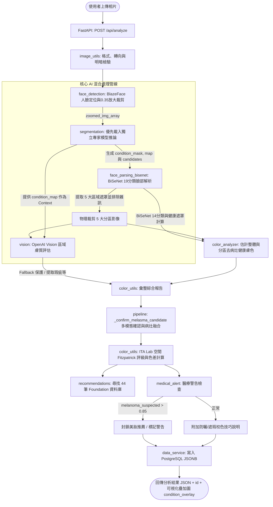

# Lumière 系統分析管線與模型盤點報告

本報告針對 Lumière 後端系統的影像分析管線（Pipeline）與模型清單進行全面盤點，詳述其順序、功能、使用模型、每一步驟的輸入輸出，以及目前系統內所有模型（使用中、未使用、測試中）的名稱、位置與功能說明。

---

## 1. 系統分析管線 (Analysis Pipeline)

Lumière 後端採用 FastAPI，建構了一套混合式的 AI 分析管線。該管線結合了本機人臉檢測與放大模型（MediaPipe BlazeFace）、本機深度學習語意分割模型（SegFormer 獨立專家模型、BiSeNet 14/19 分類臉部解析）以及雲端多模態大模型（OpenAI Vision）。

### 核心分析管線流程圖 (Pipeline Logic Flow)

### 管線步驟詳解 (Detailed Pipeline Steps)

#### 步驟一：影像前置處理與人臉放大裁剪 (Image Preprocessing & Face Zooming)
* **主要模組**：
  * [image_utils.py](file:///l:/Lumiere/Back_Lumiere/dev/app/image_utils.py) (`preprocess` 與 `load_and_validate`)
  * [face_detection.py](file:///l:/Lumiere/Back_Lumiere/dev/app/face_detection.py) 及 [face_detection_mediapipe.py](file:///l:/Lumiere/Back_Lumiere/dev/app/face_detection_mediapipe.py) (`detect_and_zoom_face`)
* **主要功能**：
  1. 對上傳的圖片進行二進位圖檔驗證與 BGR 轉 RGB。
  2. 自動偵測與校正手機拍攝時產生的 EXIF 旋轉方向，並過濾過小（單邊 < 300px）、過暗（平均亮度 < 20）或過亮/過曝（平均亮度 > 235）的劣質相片。
  3. 使用 **MediaPipe Face Detector (BlazeFace)** 模型定位人臉。若無檢測到人臉則拋出異常引導用戶調整。
  4. 鎖定最大人臉框，向外擴展 35% (padding_ratio = 0.35) 進行實體裁剪，輸出無插值失真的 zoomed 臉部影像，後續所有模型都對此放大的人臉圖像進行分析，有效排除背景、雜訊與非臉部區域。
* **使用模型**：**MediaPipe Face Detector** (BlazeFace Short Range, `blaze_face_short_range.tflite`)。
* **輸入**：原始圖片二進位內容。
* **輸出**：
  * `img_array`: 放大裁剪後的人臉 RGB 矩陣 (`np.ndarray`，型態 `uint8`)。
  * `face_image`: JPEG 格式的 Base64 編碼字串 (`str`)。
  * `face_detection`: 包含人臉 Bounding Box 座標、比例、關鍵點 (keypoints) 以及檢測信賴度之字典。

#### 步驟二：多疾病分割與融合 (Skin Condition & Wrinkle Segmentation)
* **主要模組**：[segmentation.py](file:///l:/Lumiere/Back_Lumiere/dev/app/segmentation.py) (`get_condition_outputs`)
* **主要功能**：
  1. 對 zoomed 臉部影像進行病灶與皺紋的分割推論。
  2. **獨立專家模型機制**：優先載入 Glob 匹配到的獨立專家模型群（Melasma、Wrinkle 等），過濾出符合 IoU/精準度/召回率品質門檻的模型並行推理。若無獨立模型則 Fallback 到 `deprecated/unified/best` 的 4 分類聯合模型。
  3. 用 `best_probability` 機率圖解決多專家模型間的重疊預測像素歸屬。
  4. 使用連通域演算法（面積小於總面積 0.02% 視為雜訊）去除雜訊，並用 `_estimate_zones` 估計各病灶所在的特徵區域（額頭、左頰、右頰、臉部中央、下巴）。
  5. 將 melasma 的低信賴度預測存為 `condition_candidates` 供後續步驟多模態驗證。
* **使用模型**：**SegFormer**（多個 `SegformerForSemanticSegmentation` 獨立專家模型或聯合模型）。
* **輸入**：步驟一輸出的 `img_array` (zoomed face np.ndarray)。
* **輸出**：
  * `condition_mask`: 二維分類遮罩 (`np.ndarray`，0=正常, 1=白斑, 2=黃褐斑/黑斑, 3=鮮紅斑痣, 4=額頭皺紋, 5=魚尾紋, 6=法令紋)。
  * `condition_map`: 結構化病灶統計（檢測狀態、面積佔比、所在區域）。
  * `condition_candidates`: 用於多模態確認的黑斑低信賴度候選遮罩與資料。

#### 步驟三：人臉語意分割與分區裁剪 (Face Parsing & Region Masking/Cropping)
* **主要模組**：[face_parsing_bisenet.py](file:///l:/Lumiere/Back_Lumiere/dev/app/face_parsing_bisenet.py) (`parse_face`, `build_face_region_masks`, `extract_region_crops`)
* **主要功能**：
  1. 呼叫 19 分類 BiSeNet 模型得到 face parsing map。
  2. 基於 `SKIN_LABEL` = 1 (皮膚) 與 `NOSE_LABEL` = 10 (鼻子) 等語意類別，建立 5 大分區的幾何遮罩：額頭 (`testa`)、左頰 (`bochecha_e`)、右頰 (`bochecha_d`)、鼻子 (`nariz`)、下巴 (`queixo`)。
  3. 對各分區進行 15px 邊緣填充的物理裁剪。
  4. 在物理裁剪前將亮度最大值 < 30 的非皮膚像素（如頭髮、陰影、背景）清除為純黑 `[0, 0, 0]`，以保證 OpenAI 獲取的圖像只聚焦在皮膚上。
* **使用模型**：**BiSeNet 19 分類模型** (ResNet-18 骨幹，`79999_iter.pth`)。
* **輸入**：步驟一輸出的 `img_array` (zoomed face np.ndarray)。
* **輸出**：
  * `crops`: 五大分區的字典，包含裁剪影像陣列 `array`、JPEG Base64 `base64` 以及 bbox 範圍。
  * `parsing_map`: 完整的 19 分類解析矩陣。

#### 步驟四：健康膚色估計與分區膚色分析 (Healthy Skin Tone Estimation)
* **主要模組**：
  * [skin_tone_analyzer.py](file:///l:/Lumiere/Back_Lumiere/dev/app/skin_tone_analyzer.py) (`analyze_skin_tone`)
  * [color_analyzer.py](file:///l:/Lumiere/Back_Lumiere/dev/app/color_analyzer.py) (`analyze_region_colors`)
* **主要功能**：
  1. **健康皮膚遮罩提取演算法**：結合 14 分類 BiSeNet 膚色解析（Skin Label = 1）與 SegFormer 病灶遮罩（`condition_mask == 0`）：
     $$\text{Healthy Mask} = (\text{BiSeNet Map} == \text{Skin Label}) \land (\text{SegFormer Mask} == 0)$$
     只選取正常且完全無任何斑點、皮損與老化的像素。
  2. 計算整體健康皮膚像素的 **Median (中位數) RGB/HEX**，作為使用者代表性真實膚色，避免受化妝、極端陰影或病灶影響。
  3. 用 `analyze_region_colors` 計算 5 大區域（額頭、眼下、臉頰、嘴角、下顎）的獨立健康膚色，在 parsing map 中將 valid skin 定義為 `(parsing == 1) | (parsing == 10)` (含皮膚與鼻子) 並扣除病灶遮罩。
* **使用模型**：**BiSeNet 14 分類模型** (ResNet-18 骨幹，`bisenet_best.pth`)。
* **輸入**：步驟一的 `img_array`、步驟三的 `parsing_map` 與步驟二的 `condition_mask`。
* **輸出**：結構化膚色數據，包含整體 `median_hex`、`median_rgb` 以及各分區的膚色值。

#### 步驟五：分區細緻膚質分析 (Fine-grained Regional Skin Analysis)
* **主要模組**：[vision.py](file:///l:/Lumiere/Back_Lumiere/dev/app/vision.py) (`analyze_region`)
* **主要功能**：
  1. 將步驟三物理裁剪出的五個分區 JPEG Base64 與步驟二得到的 `condition_map` 作為 Context 送給大模型。
  2. **防盲從機制**：OpenAI Vision 必須檢查影像視覺特徵，若視覺上不支持，不得盲從 SegFormer 的 Context。
  3. OpenAI 評估該區域的 Fitzpatrick 膚色、副色調、油脂度、表面瑕疵 (acne, mancha, poro, linha, vermelhidão) 以及疑似黑色素瘤 (`melanoma_suspected`) 的信賴分數。
  4. Prompt 指示 OpenAI Vision 一次產生多語系對譯的 `notas` 字典。當 OpenAI 呼叫失敗時，回傳預設正常結構。
* **使用模型**：**OpenAI Vision** (`gpt-5.6-luna`)。
* **輸入**：分區名稱、裁剪 Base64、`condition_map` 與語系參數。
* **輸出**：大模型推論的區域評估 JSON。

#### 步驟六：多模態黑斑確認、色差計算、推薦與醫療警告 (Shade Matchmaking & Medical Triage)
* **主要模組**：
  * [pipeline.py](file:///l:/Lumiere/Back_Lumiere/dev/app/pipeline.py) (`_confirm_melasma_candidate`, `_condition_imperfections`)
  * [color_utils.py](file:///l:/Lumiere/Back_Lumiere/dev/app/color_utils.py) (`build_final_report`, `hex_to_fitzpatrick`)
  * [medical_alert.py](file:///l:/Lumiere/Back_Lumiere/dev/app/medical_alert.py)
  * [recommendations.py](file:///l:/Lumiere/Back_Lumiere/dev/app/recommendations.py)
* **主要功能**：
  1. **多模態黑斑確診 (Melasma Fusion)**：若 SegFormer 未直接偵測到黑斑但有 candidate 遮罩，且 OpenAI 在 2 個以上分區發現了 spots 色素沉著瑕疵，則系統融合確診黑斑，更新 `condition_mask` 並在 `condition_overlay` 中繪製橘色斑塊與白色線條。
  2. **ITA Fitzpatrick 級數對應**：將整體膚色轉換為 CIELAB 空間，計算 ITA 角度決定 Fitzpatrick 級數 (1~6)，對面部泛紅及光照波動作跨色彩空間校正。
  3. **色差計算**：利用 Luma-Weighted Euclidean Distance $\Delta E$ 計算分區色差。
  4. **粉底液匹配**：根據 ITA Fitzpatrick 與副色調（暖調、中性、冷調），比對內建 44 筆粉底液庫進行 $\Delta E$ 排序，限制每品牌推薦 1 款。
  5. **醫療警告攔截 (Medical Triage)**：若 `melanoma_suspected` 等臨床風險信賴度 $\ge 0.85$，系統強制啟用攔截，清空推薦陣列。
  6. **持久化**：呼叫 [data_service.py](file:///l:/Lumiere/Back_Lumiere/dev/app/data_service.py) 將完整診斷與疊加圖儲存至 PostgreSQL，返回 JSON。
* **使用模型**：無（純演算法與規則庫）。
* **輸入**：各區 VLM 評估、整體健康膚色、病灶資訊。
* **輸出**：最終彙整的診斷報告 JSON，包含 `condition_overlay` 渲染圖。

---

## 2. 系統模型盤點表 (System Model Catalog)

Lumière 系統目前各個模型檔案的配置與運作狀態盤點如下：

### (1) 執行期加載模型 (In-Use / Active)

| 模型名稱 | 模型類別/架構 | 位置 (Workspace 相對路徑) | 運行狀態 | 職責與功能說明 |
| --- | --- | --- | --- | --- |
| **MediaPipe Face Detector** | `FaceDetector` (TFLite) | `dev/app/models/blaze_face_short_range.tflite` | **使用中** (Stage 1) | 在原圖上進行 1 次快速人臉定位，為放大與裁剪（padding 0.35）提供 bounding box 與關鍵點。 |
| **SegFormer 獨立專家模型群** | `SegformerForSemanticSegmentation` | `training/checkpoints/SegFormer/models/*` (內含各專家模型目錄) | **使用中** (Stage 2) | 多標籤/專家分割模型群。啟動時依 `deployment.json` 的 metrics 閾值加載，對 zoomed 影像進行推理。分割黑斑、皺紋等，支援輸出 `condition_candidates` 作為多模態確認來源。 |
| **BiSeNet 19 分類臉部解析模型** | `BiSeNet` + `Resnet18` 骨幹 | `training/checkpoints/BiSeNet/79999_iter.pth` | **使用中** (Stage 3) | 19 分類臉部語意分割模型。定位臉部五官與皮膚精細物理界線，做為五大臉部區域實體裁剪與頭髮/背景排除的依據。 |
| **BiSeNet 14 分類臉部解析模型** | `BiSeNet` + `Resnet18` 骨幹 | `training/checkpoints/BiSeNet/bisenet_best.pth` | **使用中** (Stage 4) | 14 分類臉部語意分割模型。負責標記出皮膚區域 (Skin Label = 1)，用以扣除 SegFormer 病灶遮罩，計算去瑕疵健康代表膚色。 |
| **ResNet-18 預訓練骨幹** | `Resnet18` (PyTorch) | 載入自 PyTorch 官方 URL；定義於 `training/models/resnet.py` | **使用中** | 作為 BiSeNet-14/19 的特徵提取 ContextPath 骨幹網絡。 |
| **OpenAI Vision** | `gpt-5.6-luna` | 遠端 OpenAI API 服務 | **使用中** (Stage 5) | 遠端多模態視覺大模型。負責分區影像的細緻膚質、油脂度評估，以及疑似黑色素瘤的預警信賴度預測， Prompt 內含防盲從約束。 |

### (2) 備用、測試中與歷史模型 (Unused / Backup / Testing)

| 模型名稱 | 模型類別/架構 | 位置 (Workspace 相對路徑) | 運行狀態 | 職責與功能說明 |
| --- | --- | --- | --- | --- |
| **SegFormer 聯合多工作業模型** | `SegformerForSemanticSegmentation` | `training/checkpoints/SegFormer/deprecated/unified/best` (與 `last`) | **備用** (第二順位備援) | 早期 4 分類聯合分割模型（背景、白斑、黃褐斑、鮮紅斑痣）。當無符合品質 gate 的獨立專家模型時，做為 Fallback 載入。 |
| **MediaPipe Face Landmarker** | `FaceLandmarker` (TFLite) | 下載至本機：`~/face_landmarker.task` | **備用** | 478 特徵點網格定位模型，對應 `mediapipe_utils.py`。目前裁剪職責已被 BiSeNet 19 分類取代，僅供備用。 |
| **SegFormer 順序微調歷史模型群** | `SegformerForSemanticSegmentation` | `training/checkpoints/SegFormer/deprecated/` 下之微調子目錄 | **未使用** (歷史封存) | 包含各單一疾病（Vitiligo、Melasma、Port wine stain）順序微調的歷史存檔模型，目前已不被執行期加載。 |

---

## 3. 注意事項與實作落差

1. **獨立專家模型部署注意**：
   獨立專家模型放置於 `training/checkpoints/SegFormer/models/` 目錄。若沒有放置模型或指標未通過 quality gate (IoU >= 0.40, precision >= 0.60, recall >= 0.50)，將會自動 Fallback 到舊版 unified 聯合模型。部署時請確保 Checkpoint 的 metrics 正常並存在於對應路徑。
2. **Docker 環境下的 Checkpoint 掛載**：
   由於 `.dockerignore` 排除帶有模型權重的 `training/` 目錄，這將導致容器啟動後找不到 SegFormer 與 BiSeNet 等模型。生產環境部署時，必須確保以 Docker Volume 掛載 Checkpoints 目錄。
3. **BlazeFace 模型位置**：
   BlazeFace detector 的權重位於 `dev/app/models/blaze_face_short_range.tflite`。Dockerfile 或部署環境需確保此權重與 app 同步打包。
