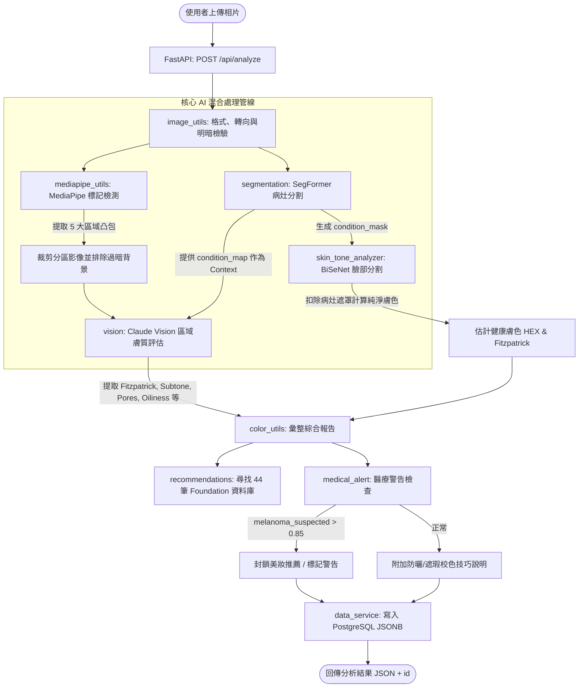

# Lumière 專案 後端結構與服務架構檢查報告

本報告針對 Lumière 後端專案 (Back_Lumiere) 進行了原始碼深入盤點，提供「後端目錄與模組架構」、「核心分析管線與演算法」、「資料庫 Schema」以及「AI 與 MLOps 模型訓練結構」的詳細清單與運作機制說明。此報告將作為後端服務維護、React 前端串接及未來 Flutter APP 移植開發的對照依據。

---

## 1. 後端目錄與模組架構盤點 (Module Mapping)

後端專案採用 **FastAPI** 作為 Web 框架，整合 **MediaPipe** (人臉標記檢測)、**BiSeNet** (臉部語意分割與健康膚色估計)、**SegFormer** (異常病灶膚況分割) 以及 **Claude Vision** (分區細緻膚質分析) 構成混合式 AI 分析管線。

### 核心模組與檔案清單

*   **服務啟動與 API 入口 (Server & Routes)**
    *   **開發伺動腳本：** [run.py](file:///l:/Lumiere/Back_Lumiere/dev/run.py)
        *   *職責：* 啟動 Uvicorn 伺服器，載入 `app.main:app`。
    *   **FastAPI 路由：** [main.py](file:///l:/Lumiere/Back_Lumiere/dev/app/main.py)
        *   *職責：* 定義 API 端點，設定跨來源資源共用 (CORS) 允許本機多個連接埠 (`http://localhost:\d+`)，並處理核心異常及回傳 JSON 封裝。包含暫時停用 (回傳 501) 的註冊端點。
    *   **設定管理器：** [config.py](file:///l:/Lumiere/Back_Lumiere/dev/app/config.py)
        *   *職責：* 使用 `pydantic-settings` 讀取根目錄的 `.env`。包含自動辨識 LLM 提供者屬性 (`provider`)：優先使用 Anthropic 關鍵字。

*   **分析管線與組件 (Analysis Pipeline & Utils)**
    *   **核心管線協調器：** [pipeline.py](file:///l:/Lumiere/Back_Lumiere/dev/app/pipeline.py)
        *   *職責：* 串接分析流程。先呼叫 SegFormer 對原始圖進行膚況病灶分割；隨後呼叫 MediaPipe 獲取臉部邊界並切割五大區域；接著在另一執行緒執行 BiSeNet 計算健康膚色；同時並行發送五個區域影像給 Claude Vision 進行細緻膚質預測；最後彙整結果、查詢推薦粉底，並套用醫療警告篩選。
    *   **影像讀取與檢驗：** [image_utils.py](file:///l:/Lumiere/Back_Lumiere/dev/app/image_utils.py)
        *   *職責：* 二進位圖檔驗證與讀取、修正手機拍攝之 EXIF 轉向問題，過濾過暗 (平均亮度 < 20) 或過曝 (亮度 > 235) 以及過小 (< 300px) 的照片。
    *   **臉部特徵點與分區裁剪：** [mediapipe_utils.py](file:///l:/Lumiere/Back_Lumiere/dev/app/mediapipe_utils.py)
        *   *職責：* 初始化及下載 `face_landmarker.task`。依據臉部特徵點索引定義 forehead (`testa`)、left cheek (`bochecha_e`)、right cheek (`bochecha_d`)、nose (`nariz`)、chin (`queixo`)。計算其凸包 (Convex Hull) 遮罩，裁剪含 15px 邊距的外接矩形，並在編碼前過濾過暗背景/頭髮像素 (通道最大值 < 30)。
    *   **異常病灶膚況分割 (SegFormer)：** [segmentation.py](file:///l:/l/Lumiere/Back_Lumiere/dev/app/segmentation.py)
        *   *職責：* 載入訓練好的 SegFormer 模型（支援多模型或單一四分類模型），檢測 Melasma (黃褐斑)、Vitiligo (白斑)、Wine Stain (鮮紅斑痣)。過濾連通域雜訊 (面積比 < 0.10% 視為噪聲)，估算病灶區域所屬臉部區塊，生成 `condition_mask` 與 `condition_map`。
    *   **健康膚色分析 (BiSeNet)：** [skin_tone_analyzer.py](file:///l:/Lumiere/Back_Lumiere/dev/app/skin_tone_analyzer.py)
        *   *職責：* 載入並呼叫 14 分類 BiSeNet 臉部語意分割模型。將 BiSeNet 膚色遮罩 (Skin Label = 1) 扣除 SegFormer 病灶遮罩 (`condition_mask > 0`) 得到真正的**健康皮膚遮罩**。藉此計算去除病理干擾的整體與五大區之中位數/平均 RGB 與 HEX 膚色值。
    *   **LLM 膚質預測 (Claude Vision)：** [vision.py](file:///l:/Lumiere/Back_Lumiere/dev/app/vision.py)
        *   *職責：* 組裝分析 Prompt (融合 SegFormer 檢測結果作為脈絡)，傳送 Base64 裁剪影像給 Claude-Opus-4-5，並強制要求回傳特定的 JSON 膚質與瑕疵欄位結構。
    *   **色差計算與報告彙整：** [color_utils.py](file:///l:/l/Lumiere/Back_Lumiere/dev/app/color_utils.py)
        *   *職責：* 估計區域間色差 Delta 值，利用 BiSeNet 健康膚色 HEX 配對 Fitzpatrick 膚色級數 (1~6)，彙整所有區域瑕疵與膚質數據，套用推薦與醫療警告。
    *   **粉底與護膚推薦：** [recommendations.py](file:///l:/Lumiere/Back_Lumiere/dev/app/recommendations.py)
        *   *職責：* 內建 44 筆主流專櫃與平價粉底色號資料庫。根據使用者膚色與副色調 (Undertone) 優先序進行配對，並根據檢測到的白斑/黃褐斑/鮮紅斑痣，加入對應的防曬修容校色指導 (如綠色/蜜桃色校色產品的使用技術)。
    *   **醫療警告與攔截 (Triage)：** [medical_alert.py](file:///l:/Lumiere/Back_Lumiere/dev/app/medical_alert.py)
        *   *職責：* 整合各區回傳的潛在醫療風險標記（如黑色素瘤懷疑度 `melanoma_suspected`）。當信賴度分數超過臨界值 (`0.85`) 時觸發醫療警示，**強制封鎖美妝推薦結果**，將推薦清單設為空，引導使用者尋求專業皮膚科醫生診治。

*   **資料儲存服務 (Database Access)**
    *   **資料庫引擎：** [db.py](file:///l:/Lumiere/Back_Lumiere/dev/app/db.py)
        *   *職責：* 載入 `DATABASE_URL`，以 SQLAlchemy 連接 PostgreSQL 資料庫，支援連線池 ping 檢查機制。
    *   **資料讀寫服務：** [data_service.py](file:///l:/Lumiere/Back_Lumiere/dev/app/data_service.py)
        *   *職責：* 提供分析結果的 CRUD。新增時自動生成 `ana_[8碼十六進制]` 唯一識別碼，將整體膚色資訊與完整結果以 `JSONB` 格式寫入資料庫；讀取時從 `analyses` 表中檢出並還原。

*   **化妝品資料庫建置腳本 (Product DB Builder)**
    *   [build_makeup_databases.py](file:///l:/Lumiere/Back_Lumiere/dev/product_database_builder/build_makeup_databases.py)
        *   *職責：* 從外部開放美妝數據庫 (Open Beauty Facts) 或 Kaggle 資料源下載、清洗並建立適合此系統的粉底液數據庫。

---

### 後端管線運作流程圖 (Pipeline Logic Flow)

---

## 2. 核心分析管線與演算法盤點 (Core Algorithms)

### (1) SegFormer 膚況病灶檢測
*   **載入邏輯：** 預設讀取 `training/checkpoints/SegFormer/` 下對應條件的權重。若環境設定 `SEGFORMER_SOURCES_JSON` 則從該路徑優先加載。
*   **模型融合：** 依據 melasma (黃褐斑)、wine_stain (鮮紅斑痣) 和 vitiligo (白斑) 的順序進行預測，融合成統一的條件遮罩（`condition_mask`，1 = 白斑，2 = 黃褐斑，3 = 鮮紅斑痣）。
*   **區域判斷 (`_estimate_zones`)：** 藉由各個病灶遮罩像素在 X 軸與 Y 軸的平均比例，自動識別病灶所在的五大特徵臉部區塊：
    *   Forehead (前額)：Y 坐標位於上半部 35% 區間。
    *   Left Cheek (左臉頰)：X 坐標位於左側 45% 區間。
    *   Right Cheek (右臉頰)：X 坐標位於右側 55% 區間。
    *   Center Face (中臉/鼻子)：X 坐標位於 35% 到 65% 中間。
    *   Chin (下巴)：Y 坐標位於底部 28% 區間。

### (2) BiSeNet 健康膚色去病灶估算
*   **痛點解決：** 一般人臉膚色偵測容易受到面皰、白斑或大面積色素斑塊干擾，導致測得之粉底色號失準。
*   **健康皮膚提取演算法：**
    $$\text{Healthy Mask} = (\text{BiSeNet Map} == \text{Skin Label}) \land (\text{SegFormer Mask} == 0)$$
    僅在雙重遮罩判定為「正常皮膚且無病理色斑」的區域上，取得像素點。
*   **中位數提取：** 使用健康皮膚遮罩中像素點的 **Median (中位數) RGB** 來代表整體皮膚的真實色澤，避免極端亮度或局部陰影影響。
*   **區域膚色計算：** forehead, under_eyes, cheeks, around_mouth, jawline 區域各自應用該遮罩，計算出各分區的獨立 RGB 與 HEX 數值。

### (3) Claude Vision 區域分析 Prompt 機制
*   **輸入內容：** 每張裁剪出的五官分區影像 + SegFormer 所分析出的整體病灶 Context（以 JSON 字串傳入）。
*   **Prompt 要求：** Claude 必須比對視覺特徵與 SegFormer 提供的提示，若視覺上不支持，不得盲從 SegFormer 的預測；回應必須是純 JSON，含有色值、Fitzpatrick、Subtone、Oleosidade (油性)、Imperfeicoes (瑕疵清單) 等。
*   **支援語系：** 傳入語系參數 `lang` 後，藉由對譯表自動將 Prompt 的「notas (備註)」指定語言設為 Traditional Chinese (`tw`)、Simplified Chinese (`zh`)、English (`en`) 等。

### (4) 色差計算與粉底匹配 (Foundation Shade Matchmaking)
*   **色差演算法 (Luma-Weighted Euclidean Distance)：**
    $$\Delta E = \sqrt{(0.299 \times \Delta R)^2 + (0.587 \times \Delta G)^2 + (0.114 \times \Delta B)^2}$$
    該公式考量人眼對不同顏色的敏感度（對綠光最敏感、藍光最弱），用以計算區域膚色差。色差大於 20 為高 (`alto`)，10~20 為中等 (`moderado`)，小於 10 為低 (`baixo`)。
*   **粉底匹配機制：**
    *   當 BiSeNet 的中位數 HEX (`skin_hex`) 存在時，優先以此色值為基礎，對 44 筆粉底色號進行 Delta 距離排序。
    *   過濾與使用者「副色調」(如冷/暖/中性) 不合的品項：優先篩選同色調品項，若無才依 Fallback 順序（暖調 $\to$ 中性 $\to$ 冷調）推薦。
    *   限制各品牌僅推薦 1 支最合適色號（`max_per_brand = 1`）。
    *   若無 BiSeNet 健康膚色，才退回使用 Fitzpatrick 階層的代表性 HEX 進行粗估匹配。

### (5) 醫療警告與自動攔截
*   **攔截判定：** LLM 分析中若發現 `melanoma_suspected` (疑似黑色素瘤)、`suspicious_lesion` (可疑皮損) 或 `urgent_skin_concern` (緊急皮膚狀況) 其中之一的信賴度分數 $\ge 0.85$。
*   **攔截行為：** 呼叫 `apply_medical_triage`，將 `recommendations_blocked` 設為 `true`，**清空推薦產品陣列**，並產生警告的警告文案，避免推薦化妝品延誤使用者就醫治療。

---

## 3. 資料庫結構與實作盤點 (Database Schema)

系統採用 PostgreSQL 進行分析歷史儲存。在啟動時會藉由 [init.sql](file:///l:/Lumiere/Back_Lumiere/db/init.sql) 建立主表結構。

### `analyses` 資料表詳細結構

| 欄位名稱 | 資料類型 | 約束條件 | 說明 |
| :--- | :--- | :--- | :--- |
| `id` | `VARCHAR` | `PRIMARY KEY` | 格式為 `ana_[8碼十六進制隨機碼]` (例如 `ana_5f3a9e12`) |
| `created_at` | `TIMESTAMPTZ` | `DEFAULT now()` | 記錄分析發生的時間與時區資訊 |
| `tom_geral_fitzpatrick` | `INTEGER` | `NULLABLE` | 整體 Fitzpatrick 膚色評級 (1 ~ 6) |
| `tom_geral_hex` | `VARCHAR` | `NULLABLE` | 健康膚色之代表性 HEX 值 (例如 `#c68b6e`) |
| `fitzpatrick_source` | `VARCHAR` | `NULLABLE` | 評級來源標記：`bisenet` (精密計算) 或 `claude` (LLM 票選) |
| `subtom_predominante` | `VARCHAR` | `NULLABLE` | 主導的副色調：`quente` (暖), `frio` (冷), `neutro` (中性) |
| `result_json` | `JSONB` | `NOT NULL` | 完整的原始管線結果 JSON，便於前端與行動端直接讀取與反序列化 |

### 資料庫操作方法
後端在 [data_service.py](file:///l:/Lumiere/Back_Lumiere/dev/app/data_service.py) 中透過 SQLAlchemy `Session` 實作：
*   **寫入：** 使用 `INSERT` SQL，將完整的 PyDantic/Dict 結果序列化，並將 Python 的 dict 封裝為 `psycopg2.extras.Json` 以寫入 `JSONB` 欄位。
*   **讀取：** 使用 `SELECT ... WHERE id = :id` 檢索。查無資料時傳回 `None`，查到資料時會自動轉換 `created_at` 為 ISO 8601 字串，並在物件中附加 `id` 後回傳。

---

## 4. MLOps 與模型訓練管線盤點 (MLOps & Model Training)

後端專案不僅僅是一個 API 伺服器，它還整合了離線數據採集腳本與深度學習訓練程式碼，便於在雲端 GPU (如 Google Colab) 或本地進行模型重新訓練與基準測試。

### 離線數據處理腳本
位於 `data-collection/scripts/`：
*   [face_parsing_bisenet.py](file:///l:/Lumiere/Back_Lumiere/data-collection/scripts/face_parsing_bisenet.py)：載入 `bisenet_best.pth` (14分類) 或 `79999_iter.pth` (19分類)，對一張 `face_crop.jpg` 進行離線臉部語意分割，並輸出 `parsing_mask.png`、顏色視覺化 `parsing_color.png` 與 metadata。
*   [skin_region_extraction.py](file:///l:/Lumiere/Back_Lumiere/data-collection/scripts/skin_region_extraction.py)：提取遮罩為 1 (皮膚) 的像素，輸出純皮膚影像。
*   [rgb_estimation.py](file:///l:/Lumiere/Back_Lumiere/data-collection/scripts/rgb_estimation.py)：對提取的純皮膚像素計算平均與中位數 RGB/HEX，保存至 JSON。

### SegFormer 訓練與部署
位於 `training/`：
*   **重新訓練管線：** [retrain_all.py](file:///l:/Lumiere/Back_Lumiere/training/retrain_all.py) 實作了順序微調流程：Melasma $\to$ Port Wine Stain $\to$ Vitiligo。它支援從中斷點恢復 (`--resume-training`)，將訓練紀錄寫入 [experiments.json](file:///l:/Lumiere/Back_Lumiere/training/experiments.json) 並在結束時自動更新 [experiment_report.md](file:///l:/Lumiere/Back_Lumiere/training/experiment_report.md)。
*   **多工作業聯合訓練器：** `training/SegFormer/unified/train_unified.py` 是一個進階腳本，混合所有病灶資料集，進行四分類 (背景、白斑、黃褐斑、鮮紅斑痣) 聯合訓練，解決順序微調時模型遺忘舊病灶分類的問題。
*   **當前生產部署模型：**
    *   模型路徑：`training/checkpoints/SegFormer/unified/best` (實質指向：`joint_mps_512_vitfirst_refine_rebalance/best` 聯合均衡訓練的成果)。
    *   **各類別測試集指標 (Val/Test IoU)：**
        *   Melasma (黃褐斑): **0.5577**
        *   Port Wine Stain (鮮紅斑痣): **0.4613**
        *   Vitiligo (白斑): **0.4321**
        *   Mean IoU: **0.4837**
    *   **部署決策：** 該聯合訓練權重在 512px 下獲得了最佳的 Vitiligo 分割表現，同時將 Port Wine Stain 與 Melasma 穩定在可接受的高效能區間，因此被選定為最終生產端運作之分割模型。

---

> [!IMPORTANT]
> **React 前端與 Flutter APP 移植開發注意事項**
> - **語系 Query 參數：** 進行 API 發送時，務必在網址帶上 `?lang=tw` (或對應語系)，以確保 Claude 產生的描述備註符合該語系。
> - **推薦封鎖旗標 (Recommendations Blocked)：** 當 API 回傳的 `result.medical_alert.alert` 為 `true` 時，前端與行動端應立即隱藏粉底商品清單，改為彈出或以醒目樣式呈現醫療警告視窗，此攔截邏輯已在後端直接處理並將 `result.recommendations` 設為空陣列。
> - **健康膚色色塊 (Median Hex)：** 由於 SegFormer 會協助去除異常色素斑塊與白斑干擾，若要顯示使用者的「真實健康膚色」，請直接使用 `result.skin_tone.median_hex`，而非將臉部分區的 `tom_hex` 隨機取樣。
