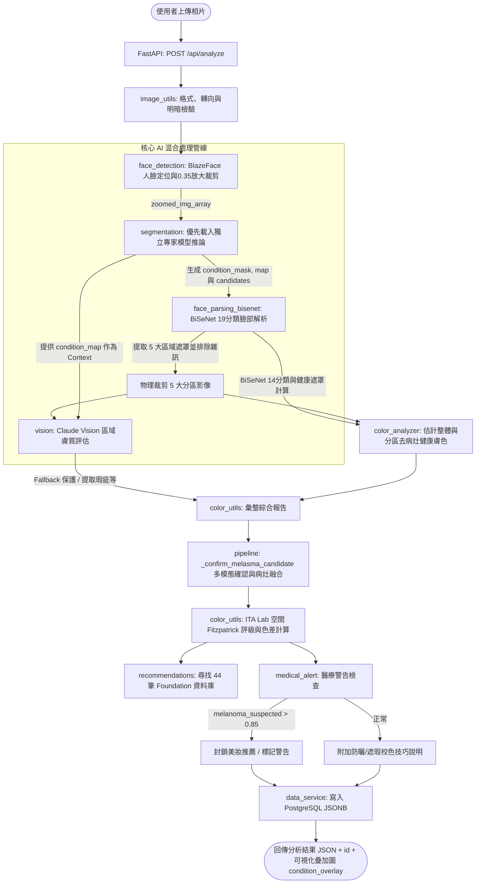

# Lumière 專案 後端結構與服務架構檢查報告

本報告針對 Lumière 後端專案 (Back_Lumiere) 進行了原始碼深入盤點，提供「後端目錄與模組架構」、「核心分析管線與演算法」、「資料庫 Schema」以及「AI 與 MLOps 模型訓練結構」的詳細清單與運作機制說明。此報告將作為後端服務維護、React 前端串接及未來 Flutter APP 移植開發的對照依據。

---

## 1. 後端目錄與模組架構盤點 (Module Mapping)

後端專案採用 **FastAPI** 作為 Web 框架，整合 **MediaPipe BlazeFace** (人臉定位與放大裁剪)、**BiSeNet** (19分類用於臉部語意分區裁剪；14分類用於整體去瑕疵健康膚色估計)、**SegFormer** (多個獨立專家模型，執行黑斑、皺紋等膚況多標籤分割) 以及 **Claude Vision** (分區細緻膚質分析) 構成混合式 AI 分析管線。

### 核心模組與檔案清單

* **服務啟動、路由與部署 (Server, Routes & Deployment)**
  * **開發啟動腳本：** [run.py](file:///l:/Lumiere/Back_Lumiere/dev/run.py)
    * *職責：* 啟動 Uvicorn 伺服器，載入 `app.main:app`。
  * **FastAPI 路由：** [main.py](file:///l:/Lumiere/Back_Lumiere/dev/app/main.py)
    * *職責：* 定義 API 端點（如 `/api/analyze`）。目前 **CORS 設定允許所有來源** (`allow_origins=["*"]`) 並搭配 `allow_credentials=True`，開放 `GET`、`POST`、`PUT`、`DELETE`、`OPTIONS`（正式環境上線前應縮限至前端特定網域）。處理核心異常並回傳 JSON 封裝，包含暫時停用 (回傳 501) 的註冊端點。
  * **設定管理器：** [config.py](file:///l:/Lumiere/Back_Lumiere/dev/app/config.py)
    * *職責：* 使用 `pydantic-settings` 讀取根目錄的 `.env`。包含自動辨識 LLM 提供者屬性 (`provider`)：優先使用 Anthropic 關鍵字。
  * **容器化組態：** [Dockerfile](file:///l:/Lumiere/Back_Lumiere/Dockerfile)、[docker-compose.yml](file:///l:/Lumiere/Back_Lumiere/docker-compose.yml)、[.dockerignore](file:///l:/Lumiere/Back_Lumiere/.dockerignore)
    * *職責：* 封裝執行環境。使用 Python 3.11 slim 及 CPU 版 PyTorch，於 Build 階段下載基礎依賴。Compose 負責啟動 PostgreSQL 16 與後端服務，並掛載 `db/init.sql` 進行初始化。
  * **相依套件表：** [requirements.txt](file:///l:/Lumiere/Back_Lumiere/requirements.txt)
    * *職責：* 執行期相依套件，鎖定固定版本的 `psycopg2-binary` 與 `sqlalchemy`。

* **分析管線與組件 (Analysis Pipeline & Utils)**
  * **核心管線協調器：** [pipeline.py](file:///l:/Lumiere/Back_Lumiere/dev/app/pipeline.py)
    * *職責：* 串接分析流程。主要邏輯如下：
      1. 呼叫 [image_utils.py](file:///l:/Lumiere/Back_Lumiere/dev/app/image_utils.py) 進行影像載入與驗證。
      2. 呼叫 [face_detection.py](file:///l:/Lumiere/Back_Lumiere/dev/app/face_detection.py) (`detect_and_zoom_face`) 定位最大人臉，並以 0.35 padding 放大裁剪，後續模型均對此 zoomed 影像進行推論。
      3. 呼叫 [segmentation.py](file:///l:/Lumiere/Back_Lumiere/dev/app/segmentation.py) 的 `get_condition_outputs` 進行多疾病病灶/皺紋分割，並生成 `condition_mask`、`condition_map` 與用於多模態確認的 melasma candidates。
      4. 呼叫 [face_parsing_bisenet.py](file:///l:/Lumiere/Back_Lumiere/dev/app/face_parsing_bisenet.py) 的 `parse_face` 對面部進行 19分類 parsing，並使用 `build_face_region_masks` 與 `extract_region_crops` 來獲取額頭、左頰、右頰、鼻子、下巴這 5 大分區的 crop JPEG Base64（排除陰影/背景）。
      5. 呼叫 [color_analyzer.py](file:///l:/Lumiere/Back_Lumiere/dev/app/color_analyzer.py) 的 `analyze_skin_tone` 搭配 14分類 BiSeNet 估算整體健康膚色；同時用 `analyze_region_colors` 估計 5 大分區的健康膚色，其計算會扣除 SegFormer 病灶遮罩。
      6. 並行發送 5 個區域的影像給 Claude Vision 進行細緻膚質預測，傳入 `condition_map` 作為背景 Context。
      7. 彙整結果、執行多模態黑斑確認、計算色差並以 ITA 演算法對應 Fitzpatrick 膚色評級，隨後查詢推薦粉底，並套用醫療警告攔截 (Triage)。
  * **影像讀取與檢驗：** [image_utils.py](file:///l:/Lumiere/Back_Lumiere/dev/app/image_utils.py)
    * *職責：* 二進位圖檔驗證與讀取、修正手機拍攝之 EXIF 轉向問題，過濾過暗 (平均亮度 < 20) 或過曝 (亮度 > 235) 以及過小 (< 300px) 的照片。
  * **第一階段人臉定位與裁剪：** [face_detection.py](file:///l:/Lumiere/Back_Lumiere/dev/app/face_detection.py) 與 [face_detection_mediapipe.py](file:///l:/Lumiere/Back_Lumiere/dev/app/face_detection_mediapipe.py)
    * *職責：* 載入並初始化 MediaPipe FaceDetector (`blaze_face_short_range.tflite`)。尋找照片中的最大人臉，並向外擴展 35% (padding_ratio = 0.35) 進行實體裁剪，輸出無插值失真的 zoomed 臉部影像，供管線後續模型分析。
  * **膚況與病灶分割 (SegFormer)：** [segmentation.py](file:///l:/Lumiere/Back_Lumiere/dev/app/segmentation.py)
    * *職責：* 管理 SegFormer 雙軌載入機制。優先讀取並篩選 `checkpoints/SegFormer/models/*` 下的獨立專家模型 (Independent Models)，利用品質閘限 (IOU >= 0.4, precision >= 0.6, recall >= 0.5) 自動過濾。若無獨立模型則 Fallback 到 `deprecated/unified/best` (舊版 4 分類聯合模型)。
  * **人臉語意分割與分區幾何裁剪：** [face_parsing_bisenet.py](file:///l:/Lumiere/Back_Lumiere/dev/app/face_parsing_bisenet.py)
    * *職責：* 載入 19 分類 BiSeNet 模型 (`79999_iter.pth`)。分割出臉部皮膚區域與器官，建立額頭 (`testa`)、左頰 (`bochecha_e`)、右頰 (`bochecha_d`)、鼻子 (`nariz`)、下巴 (`queixo`) 5 大分區的 Boolean 遮罩。進行 15px 邊距擴展物理裁剪，並將亮度最大值 < 30 的非皮膚像素 (如頭髮、背景) 歸零為純黑。
  * **去病灶健康膚色分析 (BiSeNet 14 分類)：** [skin_tone_analyzer.py](file:///l:/Lumiere/Back_Lumiere/dev/app/skin_tone_analyzer.py)
    * *職責：* 載入 14 分類 BiSeNet 模型 (`bisenet_best.pth`)。將皮膚區域標記 (Skin Label = 1) 扣除 SegFormer 病灶遮罩 (`condition_mask == 0`) 得到健康皮膚遮罩。藉此計算不受病斑與皺紋干擾的整體與分區之中位數/平均 RGB 與 HEX 膚色值。
  * **分區健康膚色分析：** [color_analyzer.py](file:///l:/Lumiere/Back_Lumiere/dev/app/color_analyzer.py)
    * *職責：* 精密計算 5 大裁剪區的健康膚色，在 parsing Map 中將 valid skin 定義為 `(parsing == 1) | (parsing == 10)` (含皮膚與鼻子)，並扣除病灶遮罩。
  * **人臉特徵點定位 (備用)：** [mediapipe_utils.py](file:///l:/Lumiere/Back_Lumiere/dev/app/mediapipe_utils.py)
    * *職責：* 原設計使用 `face_landmarker.task` 進行臉部 478 個特徵點定位與 Convex Hull 幾何裁剪。在最新代碼中，其裁剪職責已完全被 19分類的 `face_parsing_bisenet.py` 替代，目前此模組在 pipeline 預設中為**非使用中的備用狀態**。
  * **LLM 膚質預測 (Claude Vision)：** [vision.py](file:///l:/Lumiere/Back_Lumiere/dev/app/vision.py)
    * *職責：* 組裝 analysis Prompt (融入 SegFormer 檢測結果作為 Context)，傳送 Base64 裁剪影像給 `claude-opus-4-5`。Prompt 強制要求 Claude 必須比對視覺特徵，不能盲從 SegFormer Context，並一次回傳包含多國語系 (en, tw, zh, pt, fr, tr) 的 `notas` 字典。內建 Fallback 機制，當 Anthropic 呼叫失敗時回傳預設正常結構，避免系統崩潰。
  * **色差與評級彙整：** [color_utils.py](file:///l:/Lumiere/Back_Lumiere/dev/app/color_utils.py)
    * *職責：* 估計區域間色差 Delta $\Delta E$。利用 `hex_to_fitzpatrick` 函數：使用 **ITA (Individual Typology Angle)** 演算法將健康膚色 HEX 轉換為 Lab 色彩空間以估計 Fitzpatrick 膚色級數 (1~6)，對光照與泛紅更具魯棒性。
  * **粉底與護膚推薦：** [recommendations.py](file:///l:/Lumiere/Back_Lumiere/dev/app/recommendations.py)
    * *職責：* 內建 44 筆主流專櫃與平價粉底色號資料庫。根據使用者膚色與副色調 (Undertone) 進行配對，限制各品牌僅推薦 1 款，並根據瑕疵提供防曬修容校色指導。
  * **醫療警告與攔截 (Triage)：** [medical_alert.py](file:///l:/Lumiere/Back_Lumiere/dev/app/medical_alert.py)
    * *職責：* 檢查潛在醫療風險標記（如 `melanoma_suspected`）。當信賴分數超過閾值 (`0.85`) 時觸發醫療警示，**強制封鎖美妝推薦結果**，清空推薦產品清單，引導使用者尋求專業皮膚科醫生診治。

* **資料儲存服務 (Database Access)**
  * **資料庫引擎：** [db.py](file:///l:/Lumiere/Back_Lumiere/dev/app/db.py)
    * *職責：* 載入 `DATABASE_URL`，以 SQLAlchemy 連接 PostgreSQL 資料庫，支援連線池 ping 檢查機制。
  * **資料讀寫服務：** [data_service.py](file:///l:/Lumiere/Back_Lumiere/dev/app/data_service.py)
    * *職責：* 提供 analysis 結果的 CRUD。新增時自動生成 `ana_[8碼十六進制]` 唯一識別碼，將整體膚色資訊與完整結果以 `JSONB` 格式寫入資料庫；讀取時從 `analyses` 表中檢出並還原。
  * **化妝品資料庫建置腳本 (Product DB Builder)**
    * [build_makeup_databases.py](file:///l:/Lumiere/Back_Lumiere/dev/product_database_builder/build_makeup_databases.py)
      * *職責：* 從外部開放美妝數據庫 (Open Beauty Facts) 建立適合此系統的粉底液數據庫。

---

### 後端管線運作流程圖 (Pipeline Logic Flow)

---

## 2. 核心分析管線與演算法盤點 (Core Algorithms)

### (1) SegFormer 雙軌病灶檢測推論
* **獨立專家模型機制**：系統啟動時會遍歷 `training/checkpoints/SegFormer/models/*`，依據各子目錄中的 `deployment.json` 載入符合品質閾值 (IoU >= 0.40, precision >= 0.60, recall >= 0.50) 的專家模型。這些模型各自對 **zoomed 臉部大圖** 進行 1 次全臉推理。
* **重疊像素解決**：在多專家模型共同預測時，利用各像素的預測機率強度 (`best_probability`) 決定該像素的歸屬分類。
* **Fallback 聯合模型**：若無符合品質的獨立專家模型，系統會 fallback 到載入 `deprecated/unified/best` 的 4 分類聯合模型（包含背景、白斑、黃褐斑、鮮紅斑痣）。
* **新增可視化色彩疊加 (Overlay)**：分割結果產生的 `condition_overlay` 採用以下特定色彩進行半透明渲染與白色邊框繪製：
  * 白斑 (`vitiligo`)：**白色** (1)
  * 黑斑／色素沉著 (`melasma`)：**橘色** (2)
  * 鮮紅斑痣 (`wine_stain`)：**紅色** (3)
  * 額頭皺紋 (`forehead_wrinkle`)：**青色** (4)
  * 魚尾紋 (`crow_s_feet`)：**紫色** (5)
  * 法令紋 (`nasolabial_fold`)：**綠色** (6)

### (2) BiSeNet 雙分割模型應用
* **19分類臉部解析 (Stage 3)**：使用 `79999_iter.pth` 模型。精確畫出額頭、臉頰、鼻子和下巴的精細物理邊界，為 Claude Vision 提供排除背景與頭髮後的去雜訊影像。
* **14分類去病灶膚色估算 (Stage 4)**：使用 `bisenet_best.pth` 模型。將皮膚類別 (Skin Label = 1) 與 SegFormer `condition_mask == 0` 進行交集運算：
  $$\text{Healthy Mask} = (\text{BiSeNet Map} == \text{Skin Label}) \land (\text{SegFormer Mask} == 0)$$
  僅在「健康無病灶皮膚」像素上提取 **中位數 (Median) RGB** 來代表真實膚色，避免受極端陰影、泛紅或斑塊影響。

### (3) 多模態黑斑確診融合算法 (Melasma Fusion)
為了避免因為影格噪點、陰影或單點雀斑導致黑斑（melasma）的誤判，系統設計了多模態融合算法：
* SegFormer 在 `MELASMA_CANDIDATE_THRESHOLD` (0.55) 低門檻值下取得的預測會存為 candidate 遮罩。
* 若 Claude Vision 在分析 5 大區域時，有 **2 個以上區域** 獨立回傳具有 `mancha`/`spot`/`mancha_solar` 等色素沉著瑕疵時，則觸發「對側/多區域互證」。
* 系統將確診該 candidate 遮罩為 true melasma，將其寫入 `condition_mask` (值為 2) 並更新最終報告，同時繪製於 overlay 圖中。

### (4) 基於 ITA Lab 色彩空間的 Fitzpatrick 評級與色差計算
* **Individual Typology Angle (ITA) 評級**：
  `hex_to_fitzpatrick` 首先將 HEX 膚色轉換為 CIELAB 空間，計算 ITA 角度：
  $$\text{ITA} = \arctan\left(\frac{L^* - 50}{b^*}\right) \times \frac{180}{\pi}$$
  並根據生物學界建立的角度範圍對應 Fitzpatrick 1~6 級。這比單純的 RGB 歐氏距離更能抵抗光照波動與面部泛紅的干擾。當無有效 HEX 時，Fallback 到 Claude 區域投票。
* **色差演算法 (Luma-Weighted Euclidean Distance)**：
  $$\Delta E = \sqrt{(0.299 \times \Delta R)^2 + (0.587 \times \Delta G)^2 + (0.114 \times \Delta B)^2}$$
  考量人眼對綠光最敏感、藍光最弱。色差大於 20 為高 (`alto`)，10~20 為中等 (`moderado`)，小於 10 為低 (`baixo`)。

### (5) Claude Vision 區域分析與語系支援
* **防盲從設計**：Claude 接收分區影像與 SegFormer Context 進行分析，但必須依視覺特徵進行獨立評估，不得盲從 SegFormer 的預測。
* **語系 notes 字典**：Claude 被指示一次回傳多語系 notes 的 dict。

### (6) 醫療警告與自動攔截
* **攔截判定**：當 `melanoma_suspected` (疑似黑色素瘤)、`suspicious_lesion` (可疑皮損) 或 `urgent_skin_concern` (緊急皮膚狀況) 其中之一的信賴度分數 $\ge 0.85$ 時。
* **攔截行為**：將 `recommendations_blocked` 設為 `true`，**強制清空推薦產品陣列**，回傳警告文案引導就醫。

---

## 3. 資料庫結構與實作盤點 (Database Schema)

系統採用 PostgreSQL 進行分析歷史儲存。在啟動時會藉由 `db/init.sql` 建立主表結構。

### `analyses` 資料表詳細結構

| 欄位名稱 | 資料類型 | 約束條件 | 說明 |
| --- | --- | --- | --- |
| `id` | `VARCHAR` | `PRIMARY KEY` | 格式為 `ana_[8碼十六進制隨機碼]` (例如 `ana_5f3a9e12`) |
| `created_at` | `TIMESTAMPTZ` | `DEFAULT now()` | 記錄分析發生的時間與時區資訊 |
| `tom_geral_fitzpatrick` | `INTEGER` | `NULLABLE` | 整體 Fitzpatrick 膚色評級 (1 ~ 6) |
| `tom_geral_hex` | `VARCHAR` | `NULLABLE` | 健康膚色之代表性 HEX 值 (例如 `#c68b6e`) |
| `fitzpatrick_source` | `VARCHAR` | `NULLABLE` | 評級來源標記：`bisenet` (精密計算) 或 `claude` (LLM 票選) |
| `subtom_predominante` | `VARCHAR` | `NULLABLE` | 主導的副色調：`quente` (暖), `frio` (冷), `neutro` (中性) |
| `result_json` | `JSONB` | `NOT NULL` | 完整的原始管線結果 JSON，便於前端與行動端直接讀取與反序列化 |

### 資料庫操作方法

後端在 [data_service.py](file:///l:/Lumiere/Back_Lumiere/dev/app/data_service.py) 中透過 SQLAlchemy `Session` 實作：
* **寫入**：將 PyDantic/Dict 結果序列化，轉換為 `psycopg2.extras.Json` 以寫入 `JSONB` 欄位。
* **讀取**：使用 `SELECT ... WHERE id = :id` 檢索。查無資料時傳回 `None`，查到資料時會自動轉換 `created_at` 為 ISO 8601 字串，並在物件中附加 `id` 後回傳。

---

## 4. MLOps 與模型訓練管線盤點 (MLOps & Model Training)

後端專案整合了離線數據採集腳本與深度學習訓練程式碼，便於進行模型重新訓練與基準測試。

### 離線數據處理腳本
位於 `data-collection/scripts/`：
* `face_parsing_bisenet.py`：使用 14 分類或 19 分類模型對影像進行離線分割與顏色視覺化測試。
* `skin_region_extraction.py`：提取皮膚影像像素。
* `rgb_estimation.py`：計算皮膚像素平均與中位數 RGB/HEX，保存至 JSON。

### SegFormer 訓練與歷史紀錄
位於 `training/`：
* **實驗紀錄檔**：`training/TRAINING_HISTORY.md` 完整記錄了歷代 Sequential (順序微調) 與 Joint Multitask (多工作業聯合) SegFormer 訓練實驗與指標 IoU 結果。
* **重新訓練管線**：`retrain_all.py` 實作了順序微調流程，支援從中斷點恢復，更新 `experiments.json` 與 `experiment_report.md`。
* **多工作業聯合訓練器**：`training/SegFormer/unified/train_unified.py` 混合所有病灶資料集，進行四分類 (背景、白斑、黃褐斑、鮮紅斑痣) 聯合訓練。

### 模型指標對照表 (Validation/Test Metric Comparison)

| 模型類型 / 分割 Checkpoint 路徑 | 評估類別 (Label) | Test/Val IoU | 部署狀態與決策說明 |
| --- | --- | --- | --- |
| **當前生產第一優先** `training/checkpoints/SegFormer/models/*` *(獨立專家模型群)* | 各疾病 / 老化特徵 (如 Black Spot 0.7412, Forehead Wrinkle 0.4896) | **>= 0.40 ~ 0.74** | **優先部署架構** 利用 quality gate 篩選獨立專家模型進行並行推理，大幅提昇了斑點偵測精準度，同時支援老化皺紋分割。 |
| **歷史生產備用模型**  `.../SegFormer/deprecated/unified/best` | Melasma (黃褐斑) Port Wine Stain (鮮紅斑痣) Vitiligo (白斑) **Mean IoU** | 0.5577 0.4613 0.4321 **0.4837** | **備援 Checkpoint** 早期在 512px 下獲得最佳的 Vitiligo 分割表現，做為備援模型提供白斑和鮮紅斑痣的偵測能力。 |

---

## 5. 實作落差與需注意事項

### 5.1 Docker Image 未包含 SegFormer 與 BiSeNet Checkpoint
目前 `.dockerignore` 排除了 `training/*`，且 `docker-compose.yml` 也沒有將本地 Checkpoint 目錄掛載到容器內；因此 Docker 執行時可能找不到預設模型權重。部署時應將必要 Checkpoint 納入 Image，或以 Volume 掛載，並在環境變數中設定對應路徑，以提供真實推論。

### 5.2 Docker 啟動模組與程式匯入路徑需驗證
Dockerfile 以 `uvicorn dev.app.main:app` 啟動，但 `main.py` 及其相依模組使用 `from app...` 進行內部相對/絕對匯入。當工作目錄設為 `/app` 時，Python 是否能找到頂層 `app` package 取決於 `PYTHONPATH` 的正確性。團隊應以實際 `docker compose up --build` 驗證，必要時將工作目錄設為 `/app/dev` 或統一改用 `dev.app` 匯入。

### 5.3 正式環境的 CORS 設定過寬
目前路由中設定 `allow_origins=["*"]` 搭配 `allow_credentials=True` 不符合最小權限原則。上線前務必改為明確的前端 Origin 允許清單，並依實際需求縮限 HTTP methods。

---

> [!IMPORTANT]
> **React 前端與 Flutter APP 移植開發注意事項**
> * **放大後的臉部資訊 (Face Detection Details)**：API 回傳結果中包含了 `face_image` (Base64 人臉放大圖) 與 `face_regions` (各區域在放大圖中的 bounding box 與比例)。前端與行動端在展示分區細節時，應使用此放大後的臉部圖像及座標。
> * **輸出擴充欄位**：請前端接收 `condition_overlay`，此為包含透明度色塊與白色細邊框的 Base64 遮罩圖，可直接與人臉原圖重疊顯示；並利用 `legend` 欄位動態渲染當前檢測到的顏色圖例。
> * **推薦封鎖旗標 (Recommendations Blocked)**：當 API 回傳的 `recommendations_blocked` 為 `true` 時，前端與行動端應立即隱藏粉底商品清單，改為彈出或以醒目樣式呈現醫療警告視窗，此攔截邏輯已在後端直接處理並將 `recommendations` 設為空陣列。
> * **去瑕疵健康膚色 (Median Hex)**：由於 SegFormer 會協助去除異常色素斑塊與白斑干擾，若要顯示使用者的「真實健康膚色」，請直接使用 `result.skin_tone.median_hex`，而非隨機取樣。