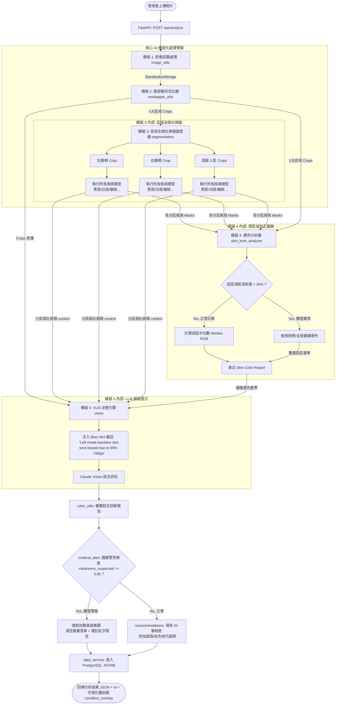

# Lumière AI Hybrid Analysis Pipeline

## 1. 系統架構流程圖 (System Architecture Flow)

---

### 2. 管線運作步驟詳解 (Pipeline Steps)

#### Step 1：起點 — M1（影像前置處理器）

* **實作組件**：`image_utils.py`
* **運作邏輯**：
1. 接收使用者上傳之原始照片二進位檔，進行圖檔驗證與 BGR 轉 RGB。
2. 自動偵測與校正手機拍攝時產生的 EXIF 旋轉方向，過濾過小（單邊 < 300px）、亮度過暗（平均亮度 < 20）或亮度過亮/過曝（平均亮度 > 235）的劣質相片。
3. 將影像等比例縮放至設定的最大邊長（預設為 1024px），打包好這張乾淨、標準化的照片（稱為 `StandardizedImage`），然後**交給模組 2（M2）進行人臉幾何定位**。

#### Step 2：幾何區域裁剪 — M1 ➔ M2

* **實作組件**：`mediapipe_utils.py`
* **運作邏輯**：
1. 模組 2 接收標準照片 `StandardizedImage`。
2. 利用 MediaPipe Face Landmarker 定位人臉特徵點，計算出額頭（`testa`）、左頰（`bochecha_e`）、右頰（`bochecha_d`）、鼻子（`nariz`）、下巴（`queixo`）這 5 大關鍵分區的幾何凸包（Convex Hull）。
3. 將這 5 個分區單獨裁剪下來，產出 5 張局部分區影像（稱為 `Crops`），並主動過濾背景與頭髮干擾。這能將後續模型的注意力高度收斂在真實皮膚分區，極大化提升檢測精準度。

#### Step 3：分區全疾病並行掃描 — M2 ➔ M3

* **實作組件**：`segmentation.py`（區域全檢測調度）
* **運作邏輯**：
1. **模組 3（調度器）** 接收來自模組 2 的 5 大分區 `Crops`。
2. **分區全掃描機制**：為了防止漏診任何在全臉皆可能發生的疾病（如擴散性白斑），調度器會針對 **每一個分區 Crop**，同時運行**所有的疾病專家分割模型**（黑斑、白斑、皺紋、胎記等）。
3. **並行加速與合併**：利用 `ThreadPoolExecutor` 對所有分區的各個疾病模型進行並行推理。各分支模型在局部 Crop 內產出專屬於該區域的 `Local Sub-Mask`。
4. **天然部位標籤**：由於模型是直接在特定分區 Crop（如左臉頰）上進行檢測，產出的病灶遮罩天然帶有該部位的屬性標籤（例如：左臉頰白斑），完全免去後續複雜的座標反推與映射，完美契合前端介面的「部位疾病標籤」呈現需求。
5. 最終，調度器將這些分區的局部 Sub-Masks 融合成整張臉的 `Merged Mask`，並輸出病灶面積與位置 Context。

#### Step 4：膚色計算與極端校正 — M2 + M3 ➔ M4（健康膚色分析器）

* **實作組件**：`skin_tone_analyzer.py`
* **運作邏輯**：
* **模組 4** 負責計算各分區「正常皮膚的膚色基準值」。它結合 **模組 2** 的臉部分區幾何位置與 **模組 3** 的 `Merged Mask`，進行「去瑕疵健康膚色」中位數計算，並導入 **「跨區域校正防禦機制」**：
1. **健康比例審查**：以 BiSeNet 的皮膚區域分割（Skin Label = 1）為基底，計算該分區內排除病灶遮罩後的真實乾淨皮膚佔比：

$$\text{Clean Skin Ratio} = \frac{\text{BiSeNet Skin Pixels} - \text{Disease Mask Pixels}}{\text{BiSeNet Skin Pixels}}$$

2. **正常分支**：若 $\text{Clean Skin Ratio} \ge 20\%$，扣除病灶後，直接計算該分區剩餘乾淨皮膚像素的中位數（`Median RGB/HEX`）。
3. **異常防禦分支（如 99% 左臉白斑/大面積色沉）**：若 $\text{Clean Skin Ratio} < 20\%$，為防止基準膚色被嚴重病灶強行拉偏（例如被白斑判定為純白），系統會自動觸發警報，**跨區域借用對側（如右臉頰）或全局（如額頭）的健康基準膚色來強行覆蓋**。
4. 最終產出不受嚴重病灶干擾的膚色基準報告（`Skin Color Report`）。

#### Step 5：終點與決策 — M2 + M3 + M4 ➔ M5（VLM 評估與決策引擎）

* **實作組件**：`vision.py`、`color_utils.py`
* **運作邏輯**：
* **模組 5**（Claude Vision 視覺大模型）扮演總診斷醫師，收集並綜合分區影像、病灶 Context 與基準膚色。
* **動態 Prompt 注入（Bias Hint 感知）**：若某分區曾觸發模組 4 的校正機制，模組 5 會在 Prompt 中自動補上備註（例如：*「左臉頰因 99% 白斑已由系統借用右臉膚色校正，請忽略影像中的白色病灶，依基準膚色提供色差推薦」*），防止 VLM 盲從影像外觀而產生決策偏誤。
* VLM 寫出精準的分區膚質診斷後，交由 `color_utils.py` 彙整綜合報告。

#### Step 6：安全警告攔截、推薦與持久化 (Triage, Recommendations & DB)

* **實作組件**：`medical_alert.py`、`recommendations.py`、`data_service.py`
* **運作邏輯**：
1. **醫療警示檢查（Triage）**：檢查 VLM 報告中如 `melanoma_suspected`（疑似黑色素瘤）、`suspicious_lesion`（可疑皮損）或 `urgent_skin_concern` 等臨床風險指標。一旦任一指標信賴度 $\ge 0.85$，系統會**強制啟用攔截**（`recommendations_blocked = true`），**清空推薦產品清單**並產生紅色就醫警告，避免誤導患者延誤就醫。
2. **美妝配對（Recommendations）**：若判定正常，系統會使用 `Median HEX` 色值，在內建 44 筆粉底液資料庫中進行色差（Luma-Weighted Euclidean Distance $\Delta E$）配對推薦。
3. **寫入資料庫（PostgreSQL）**：生成隨機 UUID `ana_[8碼十六進制]`，將分析結果序列化並以 `JSONB` 格式儲存至資料庫，回傳最終 JSON 給前端。

---

### 3. 5 大核心模組規劃與介面定義 (Module Roles & Interfaces)

#### 🧩 模組 1：影像前置處理器 (Preprocessor)

* **職責**：負責圖片二進位串流驗證、RGB 格式標準化、手機拍攝之 EXIF 轉向自動校正、極端明暗度（< 20 或 > 235）與尺寸過小之相片攔截過濾。
* **輸出介面**：
* `img_array`: 調整大小後的 RGB 影像矩陣 (`np.ndarray`)
* `b64_str`: JPEG 格式之 Base64 編碼字串 (`str`)
* `shape`: 影像維度元組 (`tuple` [height, width])

#### 🧩 模組 2：人臉幾何與區域定位器 (Locator)

* **職責**：利用 MediaPipe 臉部網格定位 478 個特徵點，計算出五官分區的凸包遮罩，進行邊界向外 15px 擴充裁剪並去除黑髮/背景。輸出需包含對稱區域映射表（`left_cheek` $\leftrightarrow$ `right_cheek`）。
* **輸出介面**：
* `crops`: 五大分區裁剪圖像之 Base64 與矩陣字典。
* `face_geometry`: 特徵點座標與分區物理邊界資料。

#### 🧩 模組 3：多疾病分割調度引擎 (Segmentation Dispatcher)

* **職責**：管理多個繼承自 `BaseDiseaseModel` 的專家模型分支（如黑斑、皺紋、白斑等）。對 5 個分區 Crops 進行全疾病掃描，最後依據語意優先權（如 `Melasma > Wrinkle > Normal`）將各分區結果合併，並繪製統一的半透明渲染與白色細框全臉疊加圖。
* **輸出介面**：
* `condition_mask`: 融合後的全臉二維多標籤分類遮罩矩陣。
* `local_sub_masks`: 按五大分區歸類的局部疾病遮罩與統計資料。
* `condition_overlay`: 半透明色彩疊加搭配白色細框的 Base64 疊加圖檔。
* `condition_map`: 結構化疾病檢測統計（病灶佔比、分區天然部位標籤）。

#### 🧩 模組 4：健康膚色分析器 (Color Estimator)

* **職責**：以 BiSeNet 解析人臉皮膚區域為骨幹，排除模組 3 產出的各分區病灶像素。實作 **「20% 乾淨皮膚安全閥」**，當乾淨皮膚比例低於臨界值時，自動執行跨區域（對側臉頰/額頭）健康基準膚色覆蓋邏輯。
* **輸出介面**：
* `median_hex`: 代表性健康膚色 HEX 色值。
* `zones`: 包含五大分區個別經過校正防禦後的代表性 HEX 與 RGB 字典（`SkinColorReport`）。

#### 🧩 模組 5：多模態視覺決策與推薦器 (VLM Decision Engine)

* **職責**：整合分區裁剪影像與病灶統計，若遭遇嚴重病灶覆蓋，自動於 Prompt 中注入 **Bias Hint（病灶偏誤提示）**。將資料送至 Claude Vision VLM，強制大模型避開病灶色彩干擾，做出 Fitzpatrick 膚色級數、副色調、油脂度與 `melanoma_suspected`（疑似黑色素瘤）等高精準度診斷與醫療風險指標。
* **輸出介面**：
* `vlm_report`: 結構化 VLM 分析報告（JSON 格式），含瑕疵度、色澤均勻度、 Fitzpatrick 等級及醫療風險信賴分數。

